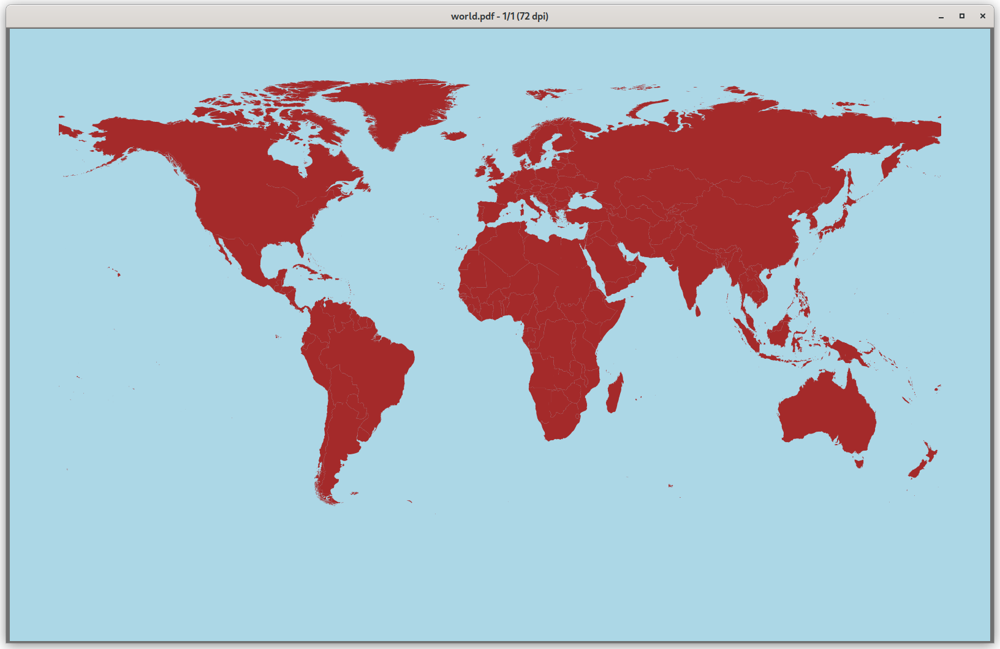
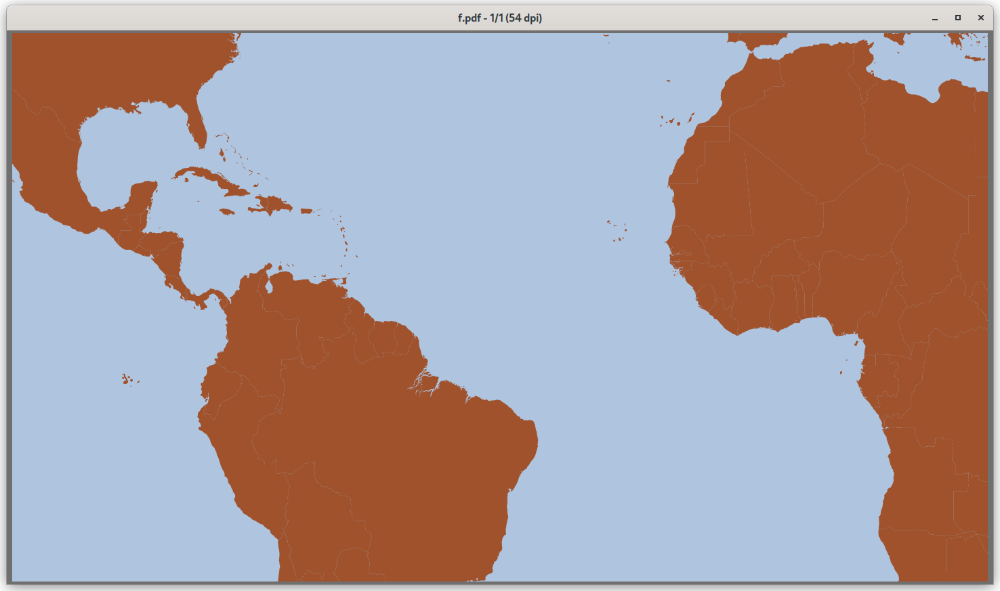
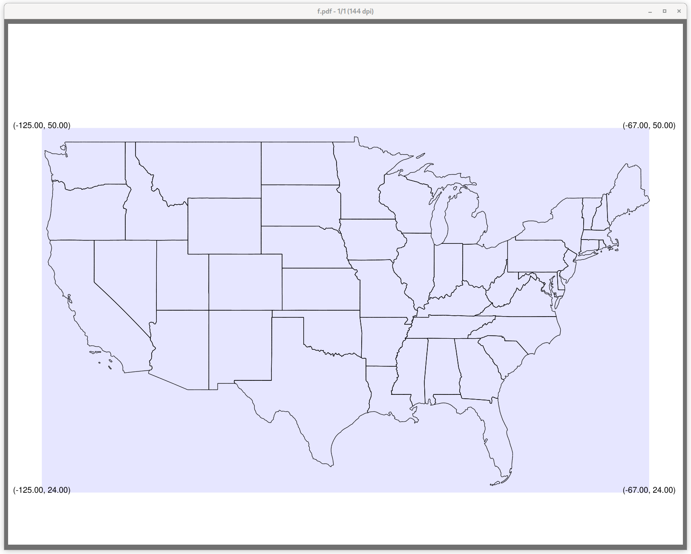
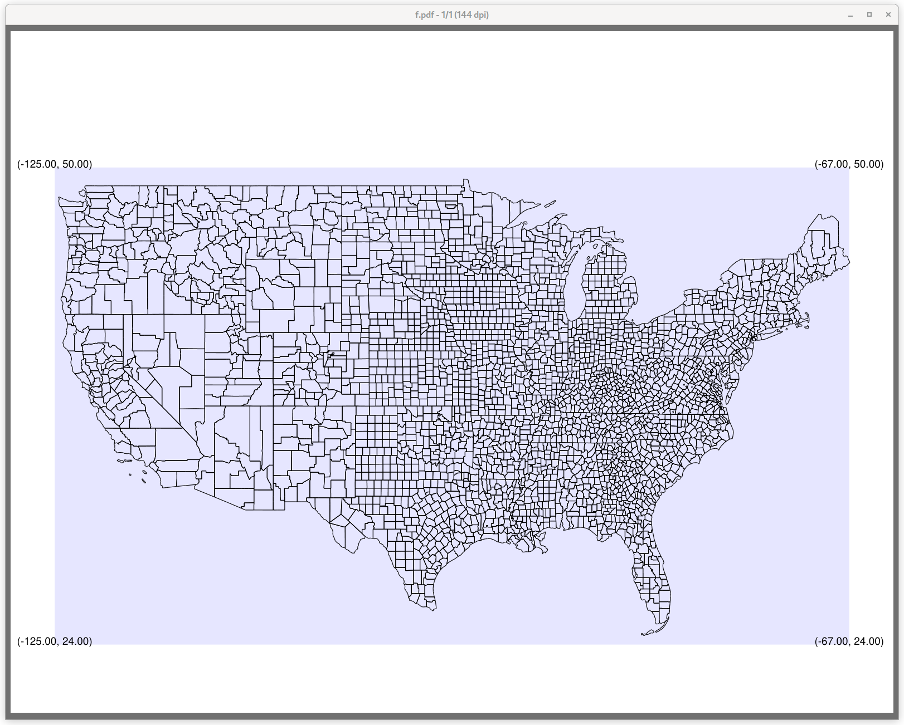
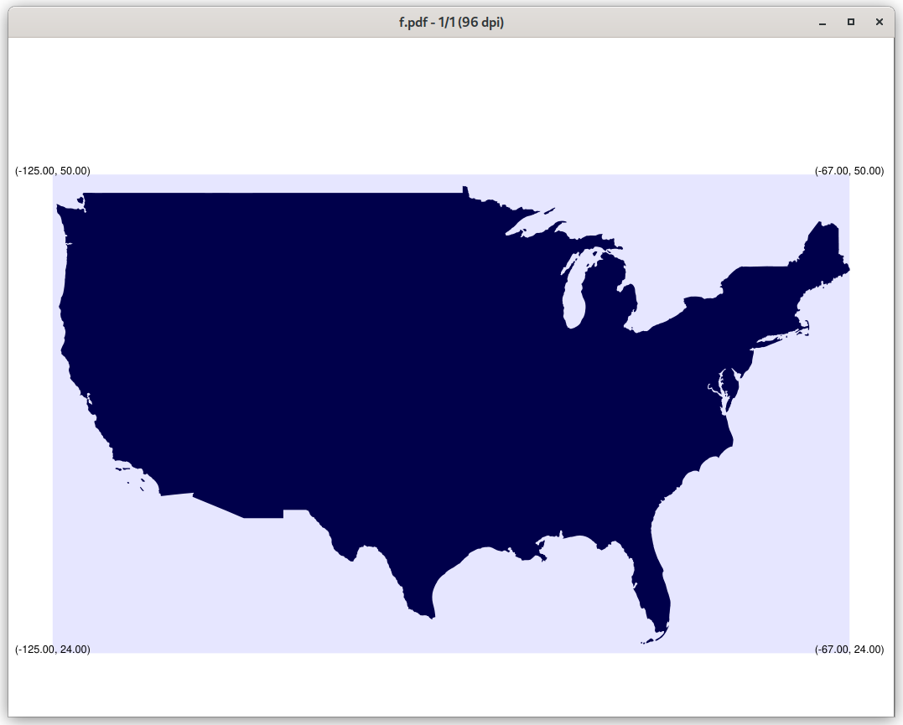

# KML

Convert KML files to deck markup

## Functions

The package has these functions:
```
BoundingBox(g Geometry, color, style string)                                        // makes a bounding box

Deckbegin(bgcolor string)                                                           // begin deck
Deckend()                                                                           // end deck

Deckshbegin(bgcolor string)                                                         // begin deck, decksh markup
Deckshend()                                                                         // end deck, decksh markup

Deckpolygon(x, y []float64, color string, g Geometry)                               // make a polygon, deck markup
Deckpolyline(x, y []float64, lw float64, color string, g Geometry)                  // make a polyline, deck markup

Deckshpolygon(x, y []float64, color string, g Geometry)                             // make polygon, decksh markup
Deckshpolyline(x, y []float64, lw float64, color string, g Geometry)                // make polyline, decksh markup

Deckshape(shape, style string, x, y []float64, lw float64, color string, g Geometry // make markup 

DumpCoords(x, y []float64)                                                          // print raw coordinates
ParseCoords(s string, g Geometry) ([]float64, []float64)                            // extract and map coordinates
ParsePlainCoords(s string) ([]float64, []float64)                                   // extract coordinates
```

The package assumes the calling main package will parse the KML files, extracting coordinates
There are two example clients:

## World


```./world world.kml | pdfdeck -stdout  -pagesize 1600x1000 - > worldoutline.pdf```



```./world  -shape=fill -bgcolor=lightblue -color=brown world.kml | pdfdeck -stdout  -pagesize 1600x1000 - > world.pdf```



```./world -latmin=-20 -latmax=35 -longmin=-100 -longmax=20 -shape=fill -bgcolor=lightsteelblue -color=sienna world.kml | pdfdeck -stdout -pagesize 1600x900 - > slave-route.pdf```

### options
```
  -bbox string
      bounding box color ("" no box)
  -bgcolor string
      background color
  -color string
      line color (default "black")
  -fulldeck
      make a full deck (default true)
  -latmax float
      latitude x maxmum (default 90)
  -latmin float
      latitude x minimum (default -90)
  -linewidth float
      line width (default 0.1)
  -longmax float
      longitude y maximum (default 180)
  -longmin float
      longitude y minimum (default -180)
  -shape string
      polygon, polyline (default "polyline")
  -style string
      deck, decksh, plain (default "deck")
  -xmax float
      canvas x maxmum (default 95)
  -xmin float
      canvas x minimum (default 5)
  -ymax float
      canvas y maximum (default 95)
  -ymin float
      canvas y minimum (default 5)

```

The included KML files are from the [opendatasoft site](https://public.opendatasoft.com/explore/dataset/world-administrative-boundaries/export/)

## usmap



```./usmap -linewidth=0.075 -bbox=blue  cb_2018_us_state_5m.kml | pdfdeck -stdout - > states.pdf```



```./usmap -linewidth=0.075 -bbox=blue  cb_2018_us_county_20m.kml | pdfdeck -stdout - > counties.pdf```



```./usmap -color "hsv(240,100,30)" -bbox blue  -shape fill   cb_2018_us_nation_20m.kml | pdfdeck -stdout - > nation.pdf```

### options
```
  -bbox string
      bounding box color ("" no box)
  -bgcolor string
      background color
  -color string
      line color (default "black")
  -fulldeck
      make a full deck (default true)
  -latmax float
      latitude x maxmum (default 50)
  -latmin float
      latitude x minimum (default 24)
  -linewidth float
      line width (default 0.1)
  -longmax float
      longitude y maximum (default -67)
  -longmin float
      longitude y minimum (default -125)
  -shape string
      polygon or polyline (default "polyline")
  -style string
      deck, decksh, or plain (default "deck")
  -xmax float
      canvas x maxmum (default 95)
  -xmin float
      canvas x minimum (default 5)
  -ymax float
      canvas y maximum (default 80)
  -ymin float
      canvas y minimum (default 10)
```

The data in the repository is from the [US Census](https://www.census.gov/geographies/mapping-files/time-series/geo/kml-cartographic-boundary-files.html)


