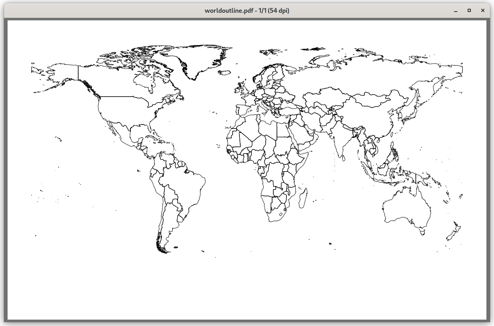

# KML

Convert KML files to deck markup

## Functions

The package has these functions:

*  ParseCoords(s string, g Geometry) ([]float64, []float64)
*  Poly(name string, x, y []float64, lw float64, color string)
*  Deckpolyline(x, y []float64, lw float64, color string)
*  Deckpolygon(x, y []float64, lw float64, color string)
*  Deckshape(name string, x, y []float64, lw float64, color string)
*  Deckbegin(bgcolor string)
*  Deckend()
*  BoundingBox(g Geometry, color string)

The package assumes the calling main package will parse the KML files, extracting coordinates
There are two example clients:

## Commands

### World



```/world world.kml|  pdfdeck -stdout  -pagesize 1600x1000 - > worldoutline.pdf```


```./world  -shape=fill -bgcolor=lightblue -color=brown world.kml | pdfdeck -stdout  -pagesize 1600x1000 - > world.pdf```

### options
```
  -bbox string
      bounding box color ("" no box)
  -bgcolor string
      background color
  -color string
      line color (default "black")
  -fulldeck
      make a full deck (default true)
  -latmax float
      latitude x maxmum (default 90)
  -latmin float
      latitude x minimum (default -90)
  -linewidth float
      line width (default 0.1)
  -longmax floatworldoutline.pdf

      longitude y maximum (default 180)
  -longmin float
      longitude y minimum (default -180)
  -shape string
      polygon or polyline (default "polyline")
  -xmax float
      canvas x maxmum (default 95)
  -xmin float
      canvas x minimum (default 5)
  -ymax float
      canvas y maximum (default 95)
  -ymin float
      canvas y minimum (default 5)
```

The included file are from [opendatasoft site](https://public.opendatasoft.com/explore/dataset/world-administrative-boundaries/export/)

### USMAP


```./usmap -linewidth=0.075 -bbox=blue < cb_2018_us_states_5m.kml | pdfdeck -stdout - > states.pdf```


```./usmap -linewidth=0.075 -bbox=blue < cb_2018_us_county_20m.kml | pdfdeck -stdout - > counties.pdf```


```./usmap -color "hsv(240,100,30)" -bbox blue  -shape fill  < cb_2018_us_nation_20m.kml | pdfdeck - > nation.pdf```

### options
```
  -bbox string
      bounding box color ("" no box)
  -color string
      line color (default "black")
  -fulldeck
      make a full deck (default true)
  -latmax float
      latitude x maxmum (default 50)
  -latmin float
      latitude x minimum (default 24)
  -linewidth float
      line width (default 0.1)
  -longmax float
      longitude y maximum (default -67)
  -longmin float
      longitude y minimum (default -125)
  -shape string
      polygon or polyline (default "polyline")
  -xmax float
      canvas x maxmum (default 95)
  -xmin float
      canvas x minimum (default 5)
  -ymax float
      canvas y maximum (default 80)
  -ymin float
      canvas y minimum (default 10)

```

The data in the repository is from the [US Census](https://www.census.gov/geographies/mapping-files/time-series/geo/kml-cartographic-boundary-files.html)


